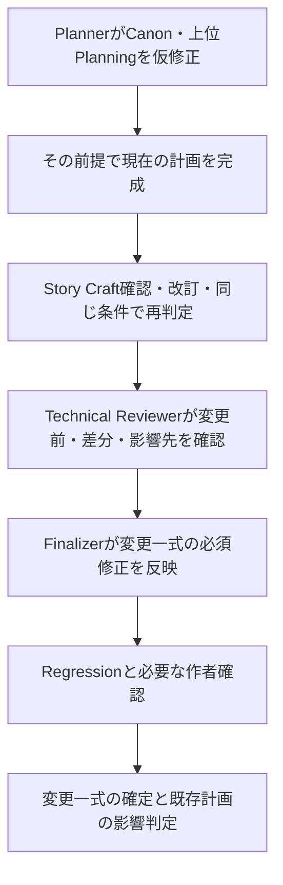

# Planning中の仮修正と作品入力の変更

状態: Canon・上位Planningの変更、レビュー、確定、影響判定の正本

通常の計画手順は [`plot-planning.md`](plot-planning.md)、入力の責務は [`planning-input.md`](planning-input.md)、役割分担は [`story-craft.md`](story-craft.md) に従う。本書は既存のレビュー工程で扱う変更範囲を定める。通常の順次Planningに新しい事前判定役を追加しない。

## 1. 二つの入口

### 下位Plannerが不足を発見した場合

Arc / Episode Plannerは、現在の計画を成立させるために必要なCanon・上位Planningの箇所を、自分で仮修正してよい。その前提で現在の計画まで完成させ、変更一式を既存のpipelineへ渡す。保存先が上位であるという理由だけで、親へ判断を返して中断しない。

場面の選択や一回限りの描写は現在のPlanningで決める。継続して使う人物・世界の事実はCanon、大きな出来事の配置や因果はOverall / Arcへ置く。情報の保存先と、誰が案を作れるかは分けて考える。

### 作者などが作品入力を途中変更した場合

既存Planningがある状態でDirection / Canon / 作者指示の意味が変わったら、親agentは次のPlanning範囲を選ぶ前に、既存計画との互換性を確認する。入口・出口、主要な判断と結果、読者への約束、Arc配置、後続の前提が変わるかを見る。表記や説明だけの修正で全Planningを無効化しない。

影響する各枝の最上位の計画を `stale` にし、理由を記録する。複数の枝に影響する場合も一つだけを見て終えない。変更済みの作品入力を守り、その計画の必要箇所と現在の対象をまとめて修正・レビューできる。上位を一つずつ確定して待ってから、下位を作り直すことは必須にしない。

新規作品を上から順に作るだけなら、通常のPlanning Readinessと各階層のpipelineで進む。途中変更がないのに互換性確認の専用stageを毎回起動しない。

## 2. 修正できる範囲

PlannerはCanonへの追加・置換・削除、Overall / 親Arcの必要箇所の変更を案として作れる。変更箇所に対応する階層の責務を守り、無関係な区間まで詳細化しない。上位の大筋を変える案も、影響先を含めてレビューする前提で作成できる。

作品方針、作者の明示指定、適用されるStyle指定、既存本文で成立した事実は変更しない。Canonや上位Planningに書かれた作者の明示指定も同様に守る。作品方針をPlanner自身の都合で書き換え、要求を満たしたことにはしない。

作者側の目的が不可欠なのに、既存方針から合理的に決められず、委任もない場合だけ、必要な判断を親へ返す。複数の創作案があるだけでは質問しない。今回の権限で既存本文まで変えることはできない。

## 3. 変更前を記録する

親agentはrun開始時に、対象と関連する作品入力の変更前を特定する。Gitのcommitとpathを使い、未commitの入力がある場合は、その内容のsnapshotも保存する。既存変更を勝手に破棄・stash・まとめてcommitしない。

次の二つを混同しない。

- 今回の作業開始版。Plannerが仮修正した差分を確認する基準。
- 旧計画が参照した作品入力。作者などによる途中変更を確認する基準。

新しく確定するOverall / Arc / Episode Designには `inputs_revision` を記録する。値は、その計画が採用した作品入力を保持するGitの40文字commit SHAとする。`parent_version` は上位Planningの版を表し、Direction / Canonの変更記録の代用にはしない。

入力が未commitなら、必要な作者確認と内容確認の後、確定する入力だけをcommitして、そのSHAを記録する。Planningと同時にCanonを採用する場合も、先に入力を保持するcommitを作り、最後に `inputs_revision` と確定metadataを揃える。Gitのcommitを作っただけでは採用済みにならない。

既存の `ready` 計画に `inputs_revision` がない場合は、作者承認時点のGit履歴や入力snapshotから基準を特定する。根拠が見つからなければ現在の入力と計画本文を照合し、確認範囲と判断を残す。古い `ready` や `parent_version` だけを根拠に互換性を仮定しない。互換性を確認できない範囲は `stale` とし、根拠の不明だけで全計画を捨てない。

## 4. 仮変更を保存して先へ進む

最初の仮変更の前に、Plannerは `planning/pending-changes.md` を作る。初期形式は [`../templates/story/planning/pending-changes.md`](../templates/story/planning/pending-changes.md) を使う。これは未確定の変更を扱うための一時的な作業記録であり、タスク管理や恒久的な変更履歴ではない。変更がなければ作らない。

記録するのは、run-id、変更前の参照、現在の対象、変更fileと見出し、追加・置換・削除の別、理由、依存する計画、レビューする影響先、元のmetadataである。削除した内容も変更前の参照と差分から確認できるようにする。行番号だけを識別に使わない。

変更した本文を、次の表示で囲む。追加・置換は変更後の本文、削除は削除位置に表示を置き、削除内容の正本はGit差分とする。

```text
【仮変更 C1：開始】
今回提案する設定または計画の本文。
【仮変更 C1：終了】
```

`C1` は同じ作業内の変更識別子であり、`pending-changes.md` の項目と対応させる。採用・不採用が決まるまで表示を外さない。設定提案で同じ案を扱う場合は、そのIDを使ってよく、本文を別の提案欄へ重複保存しない。

変更した上位Planningは `draft` とし、元の `ready / approved / version` を作業記録に残す。作者確認対象は `review: pending`、確認対象でなければ `not-required` とする。中間修正ごとにversionを増やさない。Canonにも仮変更の表示を残す。

**同じ変更一式の中だけは、仮修正したCanonと `draft / stale` の上位Planningを前提に下位の案を作ってよい。** これは下書き作成の許可であり、上位や下位が `ready` になったという意味ではない。別のPlanning、本文執筆、exportには未確定の前提を渡さない。

対象がEpisodeなら、通常の内部確認を通過した後、同じ一式の中で執筆指示の下書き生成・確認まで進めてよい。元のEpisode Designはまだdraftでも、変更後の案から必要な事実だけを渡す。執筆指示もdraftとし、一括確定時に `source_version` と採用内容を合わせる。事実や内容を変えたら執筆指示の確認もやり直す。本文執筆担当へは渡さない。

別の操作が未確定の変更を見つけたら、同じ作業の明示的な継続かを確認する。継続なら記録した基準から再開する。別の作業なら、その変更を確定設定として流用せず、未確定の作業があることを報告する。作者確認待ちと機械側の未解決を、metadataだけで同一視しない。

## 5. 変更一式を既存のpipelineで確認する



上位変更ごとに別Plannerや別runを必須にしない。現在のPlannerが上位の必要箇所も作成・改訂し、親agentは処理順、入力の受け渡し、正式出力の保存を担当する。Plannerは自分の案をレビュー・確定しない。

- Story Craft Challengerは、現在の対象と、今回変更した上位Planningの範囲を、各階層の観点で評価する。上位変更があるという理由だけで不足扱いしない。変更した報酬の配置や因果が作品全体で成立するかも、影響する範囲で確認する。
- 再判定の条件と入力はstory-craft.md §5に従う。現在の変更後の一式、変更禁止条件、評価するfile・範囲に加え、同じrunの初回不足・解消条件・維持項目、直前の項目別結果、直前判定時snapshotと改訂差分を渡す。新しい上位変更の影響先も回帰確認へ含める。Plannerの採否理由、他run、作業記録全文は渡さない。run開始版からの変更権限・参照版・依存関係等の比較はTechnical Reviewerの責務とする。
- Technical Reviewerには変更前、変更後、差分、依存先と影響先を渡す。固定条件を緩めて合格させていないか、Canonの肥大化、既存本文との矛盾、提案依存、最上位の影響箇所の見落としを確認する。上位の差分を読むだけで影響先の確認を済ませない。
- Finalizerは対象と仮変更した上位・Canonの必須修正をまとめて反映する。表示や未確定の作業記録はまだ消さない。
- Regressionは、最後のStory Craft再判定PASS時の変更一式とFinalizer後を比較する。上位やCanonの変更によって、採用した因果や報酬が失われていないかも見る。

Story Craft再判定後に新しい創作上の前提や主要な結果を変える必要が生じたら、同じ解消条件を引き継いでPlanner Revisionと再判定へ戻す。許可された改訂回数を超える場合は `blocked` とする。Regressionだけで新しい案を合格にせず、上位変更や別runを口実に回数をリセットしない。表記・入口欄・参照等の技術修正だけならFinalizerが反映し、Regressionで内容の維持を確認する。

作者確認で新しい判断や修正要求を受けた後の再計画は、通常のHuman Review規則に従って別runにできる。AI側の未解決を別runへ移して改訂回数を増やす場合とは区別する。

作者確認は `story.yaml` に従う。今回変更したOverall・Arc・Episodeのうち確認対象になっているものを一式として提示し、一度の応答でまとめて採否を受け取れるようにする。上位を先に確定するためだけの途中待ちは入れない。元の上位が `approved` でも意味を変えた案には承認を引き継がない。確認不要なら作者承認を捏造せずに進む。

## 6. 採用、不採用、影響判定

親agentは必要なレビューと作者確認を終えてから、次を一つの確定処理として行う。途中のfileを別操作が使わないよう、作業記録は最後まで残す。

1. 採用するCanon・上位・現在の計画が整合していること、未解決の依存がないことを確認する。
2. 各成果物の意味変更に対して、実行開始版からversionを最大1回だけ増やす。上位から下位へ `parent_version / source_version` を揃える。
3. 仮表示を除いた採用入力をGitへ保存し、そのcommitを `inputs_revision` に記録する。今回一緒にレビューした計画は必要な確認を満たして `ready` にする。設定提案は実際に反映した正本に従って解決し、依存行は実際に使う限り残す。
4. 今回の対象外にある既存計画を、最上位から意味で確認する。影響がある直接の子から必要な下流へ辿って `stale` にする。影響しない枝は維持する。Canon / Direction変更はOverallから影響を見るが、Overallに影響がなくても特定Arc・Episode・執筆指示へ直接影響する場合を確認する。
5. 影響しない計画は、互換性を確認した根拠を残して参照版・`inputs_revision` を合わせる。本文は書き換えない。既存の執筆指示に影響があれば `stale` とし、通常の生成・確認を通す。
6. 仮変更の表示を除き、最終snapshotと採否・影響判定をrun traceへ保存する。`planning/pending-changes.md` は確定処理の最後に削除する。

未採用のCanonだけを戻して、それに依存する計画を確定してはならない。変更の一部を不採用にする場合も、依存する案を修正し、変わった内容に必要なレビューをやり直す。AIの仮変更をすべて不採用にする場合は、作業開始版から今回の変更だけを戻す。作者が先に変更したDirection / Canonや、無関係な未commit変更は戻さない。

中断・レビュー未解決では、仮変更、変更前の参照、作業記録を残す。machine pipelineが未完なら `blocked`、必要な内部確認が終わって作者確認だけが残るなら `awaiting-human` とする。再開時に完了済み判定を使えるのは、その判定対象の内容と前提が変わっていない場合だけである。

## 7. 設計判断と初回の確認範囲

不足の保存先ごとに親へ返す方式は、同じ材料を別Plannerへ渡し直し、上位確定後に下位を再生成する往復を増やす。下位Plannerが必要な上位の案まで作り、変更と影響を既存レビューでまとめて確認する方式を採用する。

仮表示だけで安全性や速度が保証されるわけではない。変更前の記録、同じ作業内だけでの利用、影響先を含む独立レビュー、整合した一括確定を合わせて運用する。大きな変更ほどレビュー範囲も広がる。

初回実装は文書、agent指示、templateの操作契約である。自動の意味判定、変更を隔離するDB、新しいオーケストレーション基盤は追加しない。実runで親への返却回数、変更範囲、レビューでの見落としを観測し、必要な場合だけ仕組みを増やす。
